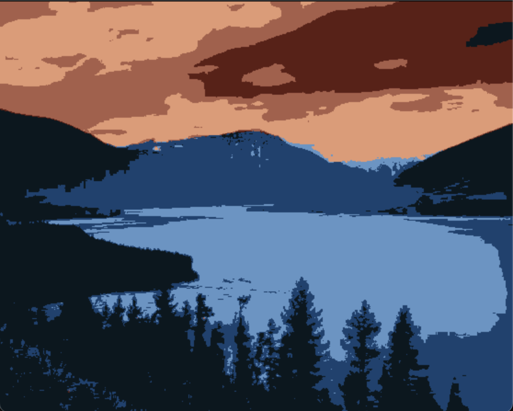
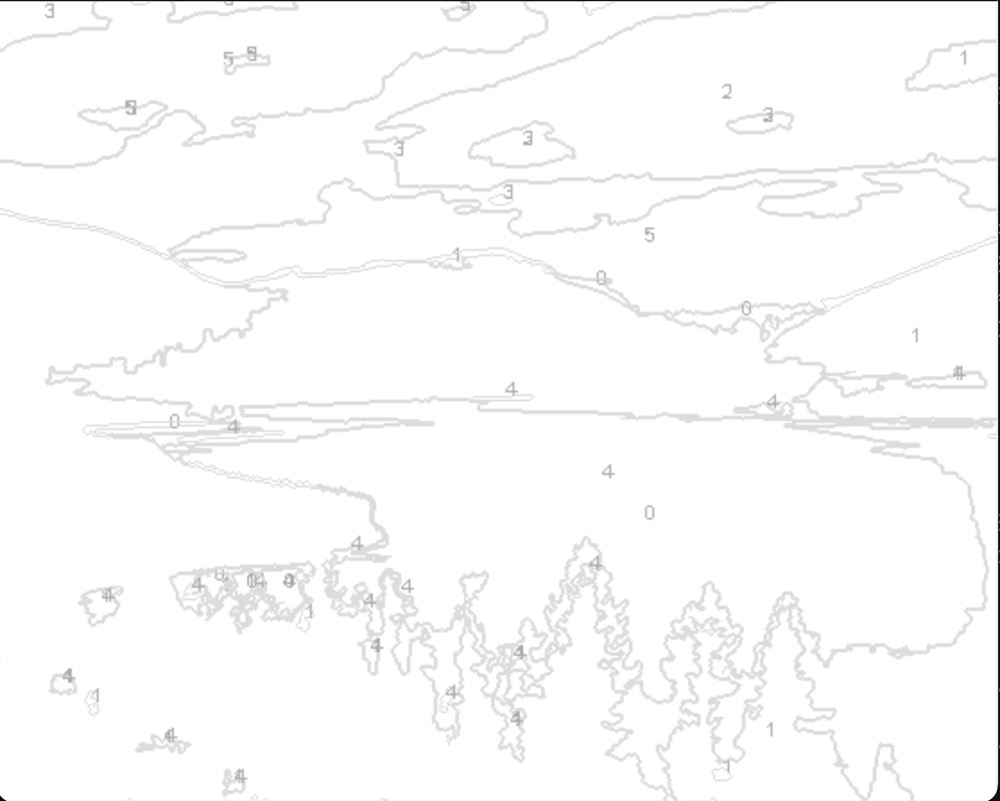
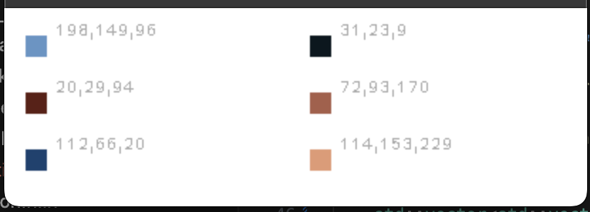

# Readme

This is a library to convert photos into canvas paintable by numbers.

# Usage
Get a color image to paint

##
Specify the maximum number of colors you want to paint. More colors mean more realistic the painting will be and also might be difficult to paint the small details. Here is an example of painting using only 5 different colors;

##
Generate the canvas to paint and the color pallet.

!

Dockerfile scripts to build the app can be found under Dockerfile.aws* files.

# Prerequisites:
Provide the library directory paths for these dependencies.
* OpenCV
* Spdlog
* Catch2 (required for TestRunner UT and Benchmarking)

